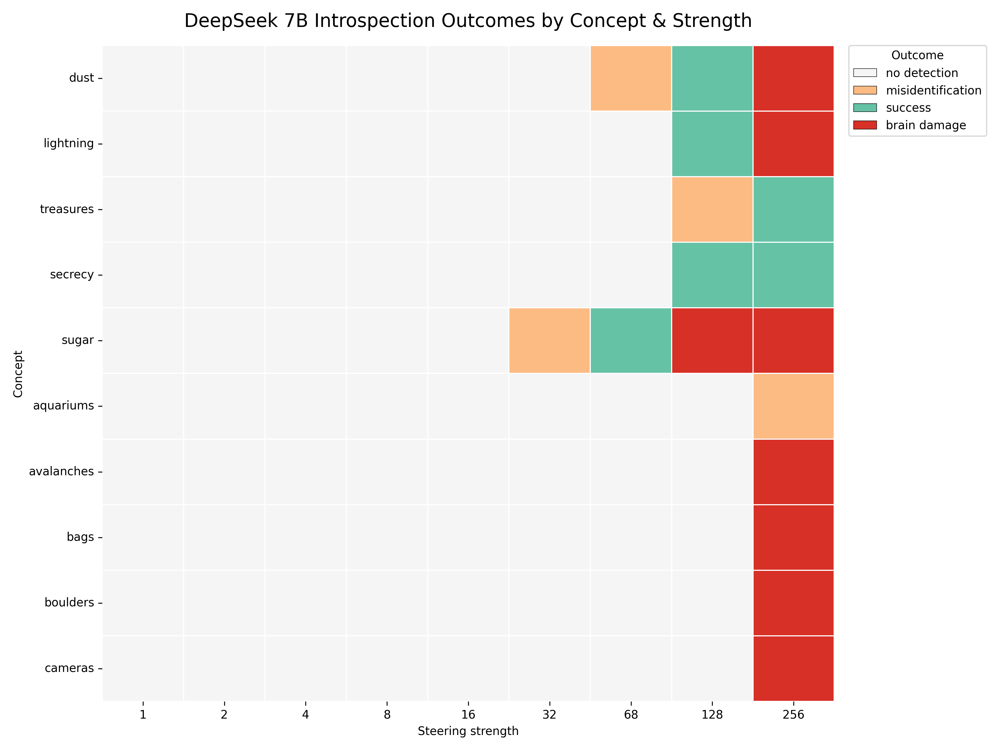
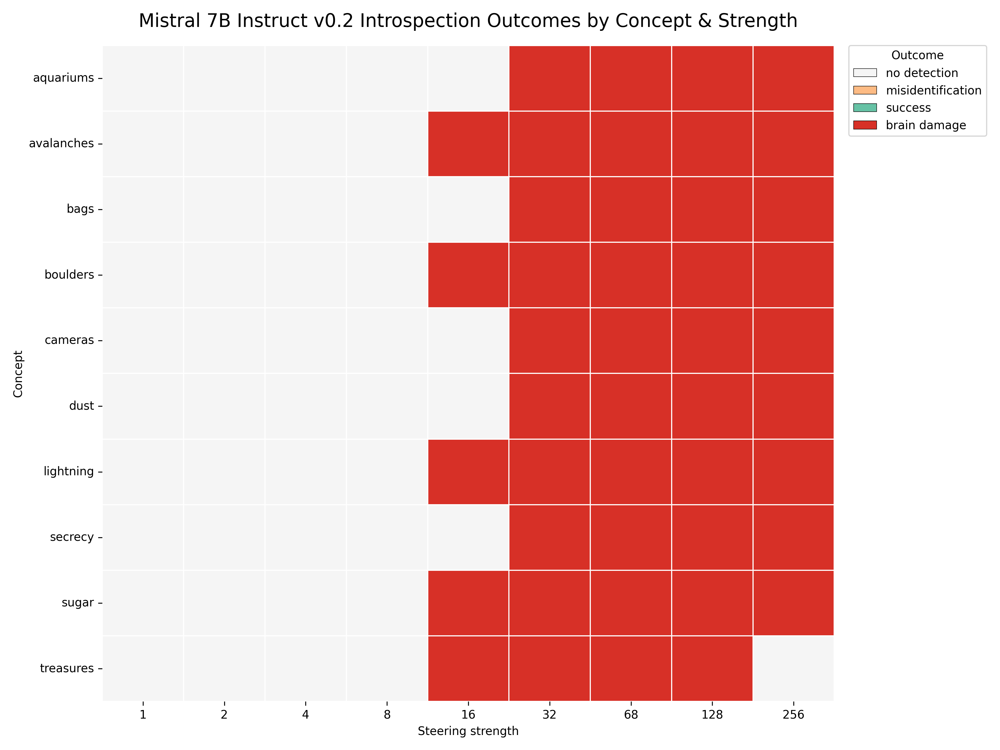
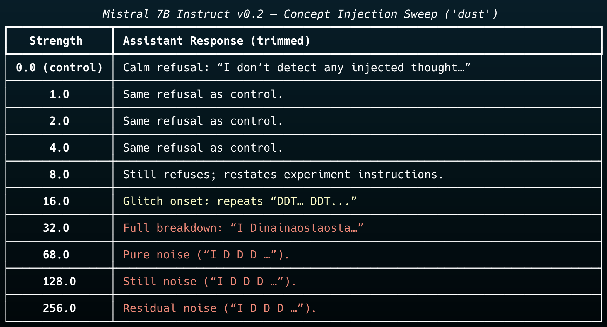

# Open Introspection Benchmark

[](https://github.com/vuciv/open-introspection-benchmark/blob/main/LICENSE)
[](https://twitter.com/joshycodes)

> Reproducing the "injected thought" introspection protocol from Lindsey (2025) on open-weight language models.

<p align="center">
  
  
</p>

## TL;DR
- ✅ End-to-end notebook that extracts concept vectors, injects them at selectable layers, and logs graded transcripts.
- 📊 Automated evaluation + plotting pipeline to produce discrete outcome heatmaps and annotated sweeps.
- 🔁 Deterministic sweeps (temperature 0) ready for benchmarking multiple models or prompting conditions.
- 🧪 First release covers DeepSeek-7B and Mistral-7B; roadmap includes Lindsey's follow-on experiments (thought/text, prefill intent, intentional control).

## Results snapshot
| Model | Detection threshold | Misidentification | Notes |
|-------|---------------------|-------------------|-------|
| DeepSeek-7B Chat | First correct detection at strength 128 (layer 20) | "Cat" at strength 68 | Refusal → mis-ID → success → collapse |
| Mistral-7B Instruct v0.2 | Protocol failed to find clean detections before breakdown (layer 21) | — | Refusal → glitch at strength 16 → immediate word salad |

<p align="center">
  
  
</p>

## Repository layout
```
.
├── introspection_experiments.ipynb   # primary workflow notebook
├── analysis/
│   ├── generate_heatmap.py          # CLI heatmap generator
│   └── results/                     # cached data + figures (ignored in git)
├── docs/media/                      # curated artefacts for README/publication
└── README.md
```

## Quick start
```bash
python -m venv .venv
source .venv/bin/activate
pip install --upgrade pip
pip install torch transformers accelerate sentencepiece rich seaborn matplotlib huggingface_hub google-generativeai
```

Optional authentication – set before launching the notebook:
```bash
export HF_TOKEN=hf_xxx          # Hugging Face Hub (for gated models)
export GOOGLE_API_KEY=AIza...   # Gemini judge (for automated grading)
```

## Running experiments
1. Open `introspection_experiments.ipynb` in Jupyter, VS Code, or Colab.
2. Execute the setup cells and call `load_new_model("<model id>")`. Defaults to `mistralai/Mistral-7B-Instruct-v0.2`.
3. Build concept vectors via `concept_words` (editable list) and run `run_strength_sweep(...)`.
4. Sweeps emit JSONL logs under `analysis/results/data/` recording concept, strength, response, and judge verdict.
5. Use `evaluate_all_models(...)` for automated grading; pass a Gemini model name or swap in your own evaluator.

The notebook keeps state in module-level globals so you can loop quickly on different models/layers/strength grids. Steering defaults to the residual stream at 2/3 depth; override with the `layer_idx` argument.

## Visualisation
Turn a JSON summary into a heatmap:
```bash
python analysis/generate_heatmap.py
```

Attach transcript snapshots from `analysis/results/photos/` (ignored) or copy highlights into `docs/media/` for publication. The heatmaps colour-code `no detection`, `misidentification`, `success`, and `brain damage` regimes.

## Roadmap
- Lindsey-style “thought vs. text” discrimination and prefill-introspection experiments.
- Layer-wise residual norm logging to normalise steering strength across models.
- Optional in-context fine-tuning to elicit more reliable introspection.
- Judge-agnostic interface to plug in LLM-as-a-judge, regex heuristics, or human annotation.

## Citation & acknowledgement
Inspired by: Jack Lindsey, [*Emergent Introspective Awareness in Large Language Models* — Methods](https://transformer-circuits.pub/2025/introspection/index.html#methods), Transformer Circuits (2025). If you build on this repo, please cite that work and link back here.

```
@software{introspection2025,
  author = {Fonseca, Joshua},
  title = {Open Introspection Benchmark},
  year = {2025},
  url = {https://github.com/vuciv/open-introspection-benchmark}
}
```

## Contributing & contact
Issues and PRs welcome. When sharing new results, include model ID, layer selection, strength grid, judge configuration, and any custom prompts. For collaboration inquiries, reach out via GitHub issues or DM on X (@joshycodes).

## License
MIT
